# Tri·log — 系統架構文件

> **目標讀者**：第一天入職的 RD。讀完這份文件後，你應該能回答「一個 HTTP request 從瀏覽器到資料庫的完整路徑是什麼？」

---

## 目錄

1. [產品一句話定義](#1-產品一句話定義)
2. [整體系統架構圖](#2-整體系統架構圖)
3. [目錄結構與模組職責](#3-目錄結構與模組職責)
4. [模組關係圖](#4-模組關係圖)
5. [Authentication Flow（登入流程）](#5-authentication-flow)
6. [API Flow（資料請求流程）](#6-api-flow)
7. [Database Flow（資料庫層）](#7-database-flow)
8. [第三方服務整合](#8-第三方服務整合)
9. [部署架構（AWS 方向）](#9-部署架構)
10. [關鍵設計決策 Q&A](#10-關鍵設計決策-qa)

---

## 1. 產品一句話定義

**Tri·log** 是鐵人三項選手的**成績記錄與跨賽事排行榜平台**。  
選手可登錄 / 認領賽事成績，公證後進入全球排行榜。

---

## 2. 整體系統架構圖

```mermaid
graph TB
    subgraph 使用者端 Browser
        UI[Next.js React UI<br/>Tailwind CSS]
    end

    subgraph Vercel CDN / Edge
        EDGE[Next.js Middleware<br/>路由守衛 · session 刷新]
        SSR[Server Components<br/>資料預取 · SEO]
        API[Route Handlers<br/>/api/*]
    end

    subgraph Supabase Cloud
        AUTH[Supabase Auth<br/>Email / Google / Apple]
        DB[(PostgreSQL<br/>8 張資料表<br/>RLS policies)]
        STORAGE[Supabase Storage<br/>完賽證書 PDF/JPG]
        REALTIME[Realtime<br/>未來：即時通知]
    end

    subgraph 外部服務 External APIs
        WEATHER[Open-Meteo<br/>歷史天氣 API]
        EMAIL[Resend<br/>Email 通知]
        OAUTH[Google / Apple<br/>OAuth 2.0]
    end

    UI -->|瀏覽器 fetch| API
    UI -->|Next.js router| SSR
    UI -->|所有請求經過| EDGE

    EDGE -->|驗證 session cookie| AUTH
    EDGE -->|通過後放行| SSR
    EDGE -->|通過後放行| API

    SSR -->|Server-side query| DB
    API -->|CRUD + RPC| DB
    API -->|上傳檔案| STORAGE
    API -->|GET 天氣| WEATHER
    API -->|寄信| EMAIL

    AUTH -->|OAuth redirect| OAUTH
    AUTH -->|寫入 session cookie| EDGE

    DB -->|RLS 依 auth.uid()| AUTH
```

### 用一句話理解這張圖

> 所有流量先過 **Vercel Edge（Middleware）** 做 session 驗證，驗證後分流到 **Server Component**（SSR 靜態頁面）或 **Route Handler**（動態 API）。資料存在 **Supabase**，PostgreSQL 用 Row Level Security 控制誰看得到什麼。

---

## 3. 目錄結構與模組職責

```
trilog/
├── src/
│   ├── app/                        # Next.js App Router（頁面 + API）
│   │   ├── layout.tsx              # 根 Layout：HTML 殼、全域 CSS
│   │   ├── page.tsx                # / → redirect /leaderboard
│   │   │
│   │   ├── (main)/                 # Route Group：主應用（有 Nav）
│   │   │   ├── layout.tsx          # 主 Layout（未來放 TopNav）
│   │   │   ├── leaderboard/        # 排行榜（公開，無需登入）
│   │   │   ├── records/            # 我的成績（需登入）
│   │   │   │   └── new/            # 新增成績
│   │   │   └── profile/            # 個人 Profile（需登入）
│   │   │
│   │   ├── (auth)/                 # Route Group：認證頁（全螢幕置中）
│   │   │   ├── layout.tsx          # 置中 Layout
│   │   │   ├── login/              # 登入頁
│   │   │   └── register/           # 註冊頁
│   │   │
│   │   └── api/                    # Route Handlers（REST API）
│   │       └── auth/               # 未來：OAuth callback 等
│   │
│   ├── components/                 # React 元件（未來建立）
│   │   ├── ui/                     # 基礎 UI（Button、Input、Badge）
│   │   ├── layout/                 # 佈局元件（Nav、Footer）
│   │   ├── leaderboard/            # 排行榜相關元件
│   │   ├── records/                # 成績相關元件
│   │   └── profile/                # Profile 相關元件
│   │
│   ├── lib/
│   │   ├── supabase/
│   │   │   ├── client.ts           # 瀏覽器端 Supabase client
│   │   │   ├── server.ts           # Server Component 用 client
│   │   │   └── middleware.ts       # Edge Middleware 用 client + 路由守衛
│   │   └── utils/
│   │       ├── cn.ts               # clsx + tailwind-merge 合併 class
│   │       └── time.ts             # 秒數 ↔ HH:MM:SS 轉換工具
│   │
│   ├── hooks/                      # 自訂 React Hooks（未來建立）
│   ├── types/
│   │   ├── database.ts             # Supabase 自動生成型別（手動維護中）
│   │   └── index.ts                # 應用層業務型別（組合自 database.ts）
│   │
│   └── middleware.ts               # Next.js Middleware 入口（呼叫 lib/supabase/middleware）
│
├── supabase/
│   └── migrations/                 # 資料庫 migration SQL（按順序執行）
│       ├── 001_helpers.sql         # 共用函式（set_updated_at、role 查詢）
│       ├── 002_athletes.sql        # 選手帳號 + RLS
│       ├── 003_races.sql           # 賽事品牌 + 屆次 + RLS
│       ├── 004_results.sql         # 成績記錄（核心表）+ RLS
│       ├── 005_claim_tags.sql      # 知情人標記 + RLS
│       ├── 006_relay.sql           # 接力隊伍 / 成員 + RLS
│       ├── 007_race_editors.sql    # 賽事編輯權限 + RLS
│       ├── 008_indexes.sql         # 效能索引
│       └── 009_views_and_functions.sql  # 排行榜 View + 業務邏輯函式
│
└── docs/
    └── architecture.md             # 本文件
```

### 三層職責分工

| 層次 | 位置 | 職責 |
|------|------|------|
| **展示層** | `src/app/` + `src/components/` | UI 渲染、路由、使用者互動 |
| **服務層** | `src/app/api/` + `src/lib/` | 商業邏輯、資料驗證、外部 API 整合 |
| **資料層** | `supabase/migrations/` | 資料結構、存取控制（RLS）、資料完整性 |

---

## 4. 模組關係圖

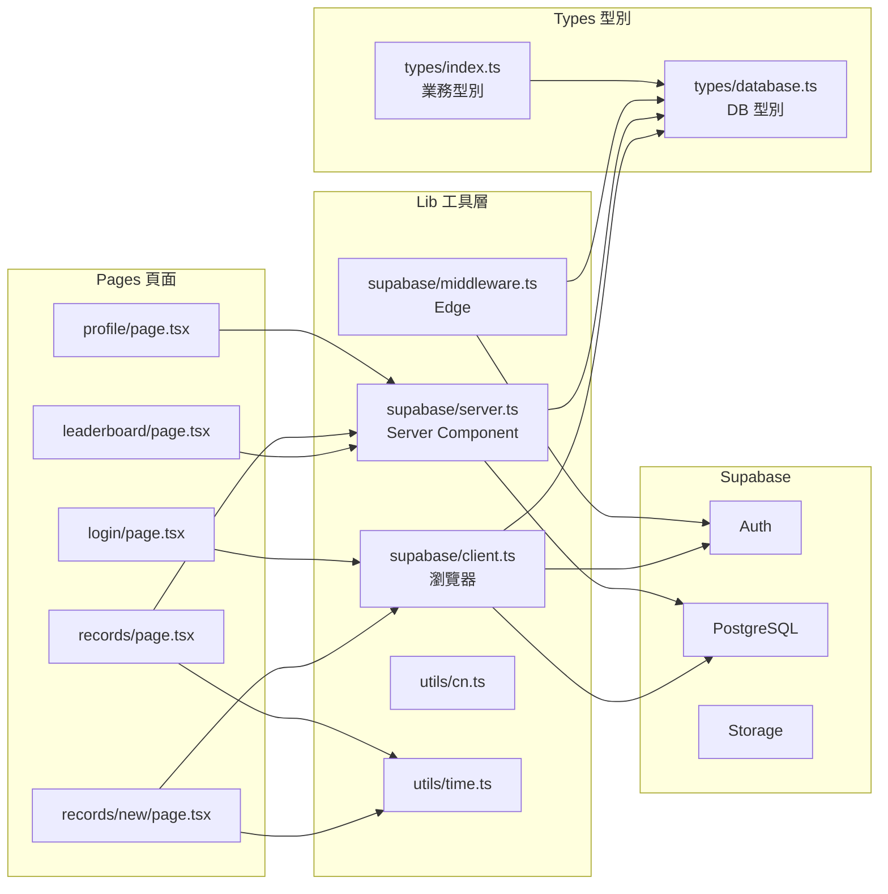

---

## 5. Authentication Flow

### 5a. Email 登入流程

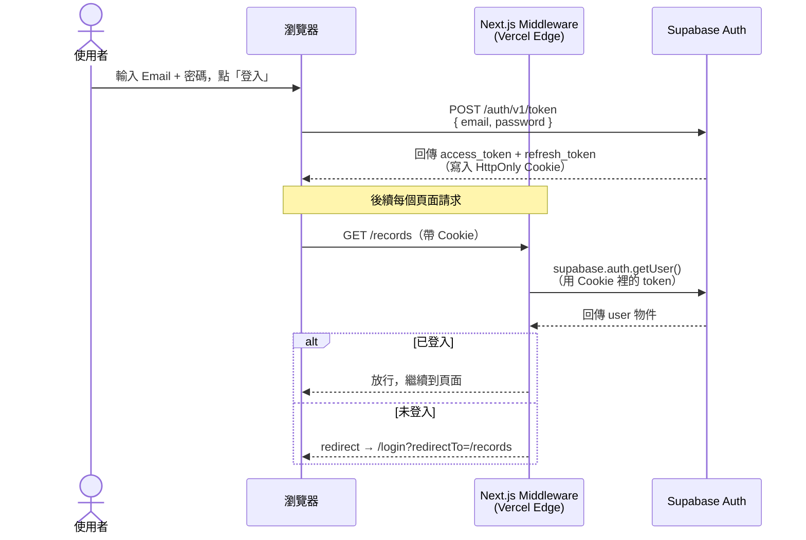

### 5b. Google / Apple OAuth 流程

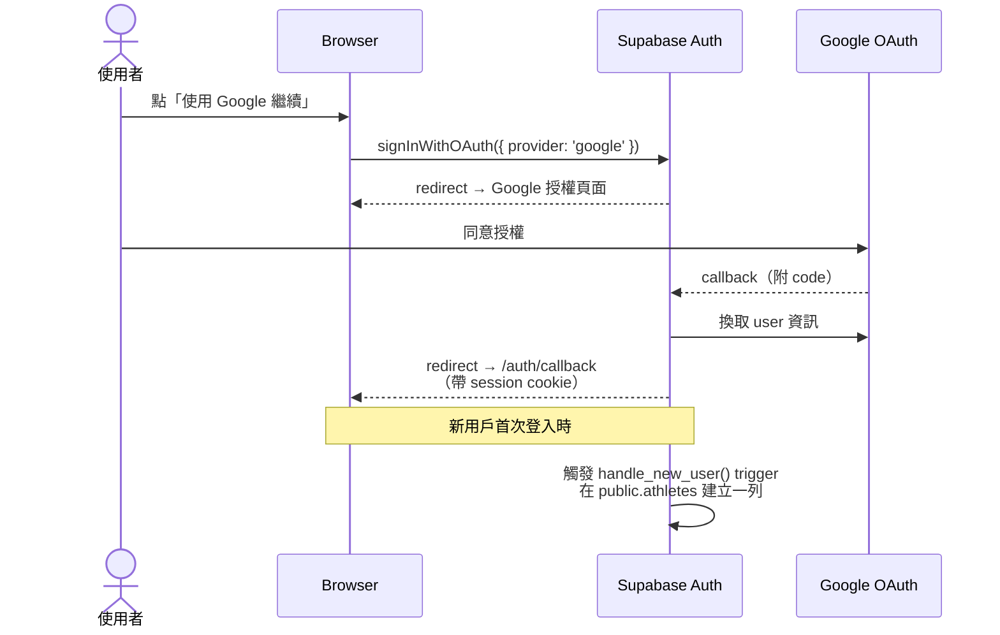

### 5c. Session 刷新機制

```mermaid
flowchart LR
    A[瀏覽器發送請求] --> B{Middleware 收到 Cookie}
    B --> C[supabase.auth.getUser()]
    C --> D{Token 是否過期？}
    D -- 未過期 --> E[放行請求]
    D -- 快過期 --> F[自動用 refresh_token 換新 token]
    F --> G[更新 Cookie]
    G --> E
    D -- 已失效 --> H[redirect /login]
```

> **重要**：Middleware 的 `updateSession()` 負責自動刷新 token，這是 `@supabase/ssr` 套件的設計。**不要**在 `createServerClient` 和 `supabase.auth.getUser()` 之間插入任何程式碼，否則 token 刷新會失敗。

---

## 6. API Flow

### 6a. 公開排行榜查詢（無需登入）

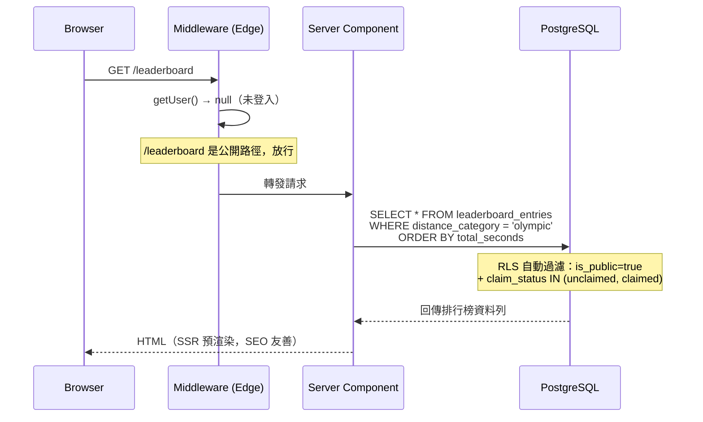

### 6b. 新增成績（需登入）

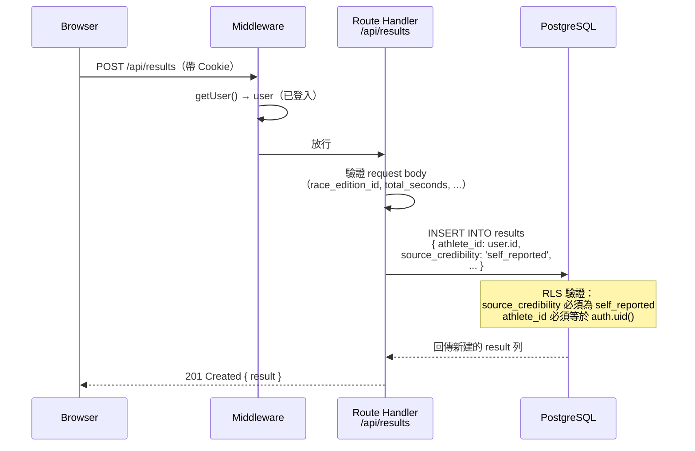

### 6c. 認領未認領成績

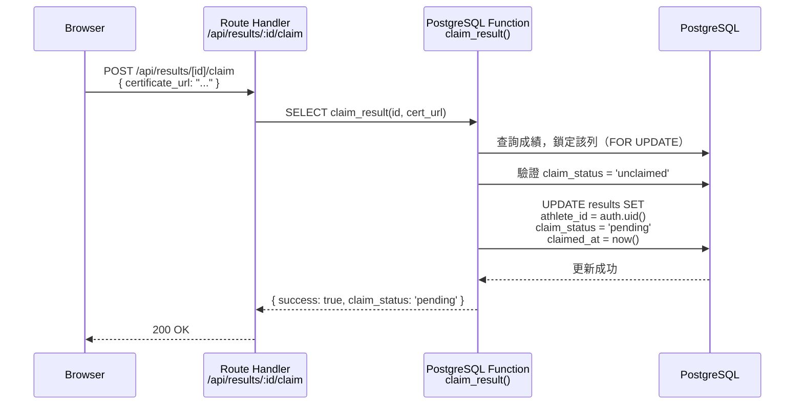

### 路由守衛規則（Middleware）

| 路徑 | 未登入 | 已登入 |
|------|--------|--------|
| `/leaderboard` | ✅ 正常訪問 | ✅ 正常訪問 |
| `/records` | ❌ redirect → `/login?redirectTo=/records` | ✅ 正常訪問 |
| `/profile` | ❌ redirect → `/login?redirectTo=/profile` | ✅ 正常訪問 |
| `/login` | ✅ 正常訪問 | ❌ redirect → `/leaderboard` |
| `/register` | ✅ 正常訪問 | ❌ redirect → `/leaderboard` |

---

## 7. Database Flow

### 7a. 資料表關係圖（ER Diagram）

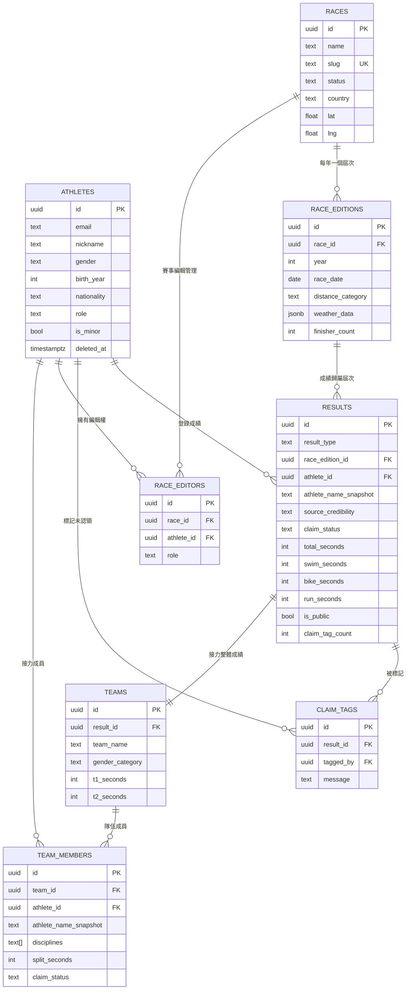

### 7b. source_credibility 狀態機

成績的可信度只能**向上升級**，不能降級：

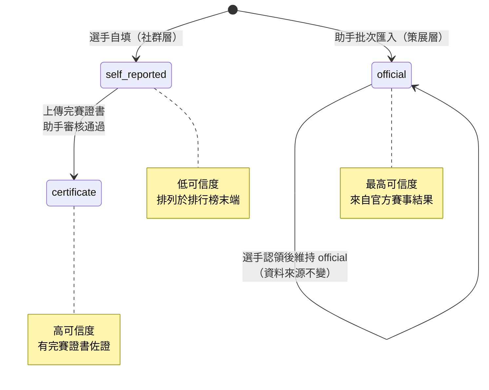

### 7c. claim_status 狀態機

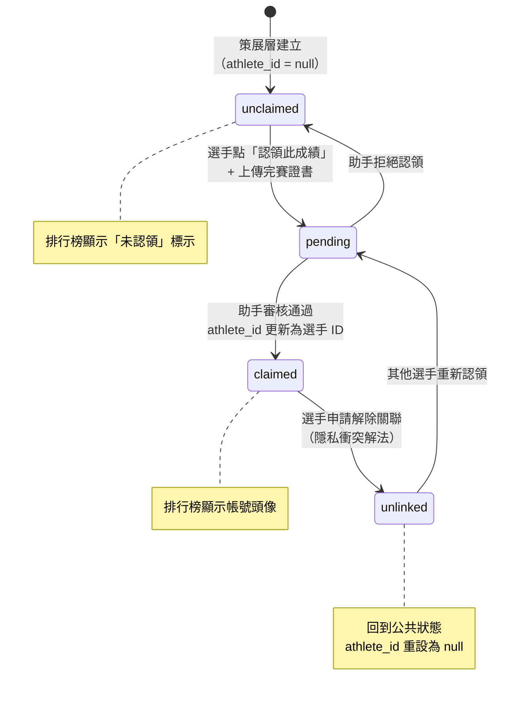

### 7d. Row Level Security 摘要

RLS 是 PostgreSQL 的**列層級存取控制**，讓每個查詢自動依使用者身份過濾資料。

```mermaid
flowchart TD
    Q[資料庫 Query] --> RLS{RLS 政策檢查}
    RLS --> ANON[匿名用戶<br/>auth.uid() = null]
    RLS --> AUTH[已登入選手<br/>auth.uid() = UUID]
    RLS --> ASST[認證助手<br/>role = 'assistant']
    RLS --> ADMIN[管理員<br/>role = 'admin']

    ANON --> A1[✅ 讀 races, race_editions]
    ANON --> A2[✅ 讀 results WHERE is_public=true<br/>OR claim_status=unclaimed]
    ANON --> A3[❌ 其他全部拒絕]

    AUTH --> B1[✅ 讀自己的私人成績]
    AUTH --> B2[✅ 新增自己的成績<br/>source_credibility='self_reported']
    AUTH --> B3[✅ 標記未認領成績]

    ASST --> C1[✅ 新增/更新賽事資料]
    ASST --> C2[✅ 審核公證申請]
    ASST --> C3[✅ 批次匯入策展層成績]

    ADMIN --> D1[✅ 全部權限]
```

---

## 8. 第三方服務整合

```mermaid
graph TB
    APP[Tri·log 後端<br/>Next.js Route Handlers]

    subgraph 已整合
        SB[Supabase<br/>Auth + DB + Storage]
    end

    subgraph Phase 1 整合
        METEO[Open-Meteo<br/>openmeteo.com]
        RESEND[Resend<br/>Email 服務]
    end

    subgraph Phase 2 整合
        GOOGLE[Google OAuth 2.0]
        APPLE[Apple Sign In]
    end

    subgraph Phase 3 整合（未來）
        GARMIN[Garmin Connect API<br/>GPX 匯入]
        STRAVA[Strava API<br/>活動資料]
    end

    APP -->|認證 + 資料 + 檔案| SB
    APP -->|GET 歷史天氣<br/>座標 + 日期 → 氣象資料| METEO
    APP -->|POST 認領通知信| RESEND
    SB -->|OAuth redirect| GOOGLE
    SB -->|OAuth redirect| APPLE
    APP -.->|未來| GARMIN
    APP -.->|未來| STRAVA
```

### 各服務說明

| 服務 | 用途 | 費用 | 設定位置 |
|------|------|------|----------|
| **Supabase** | PostgreSQL 資料庫、Auth（Email/OAuth）、Storage（完賽證書） | 免費方案：500MB DB、1GB Storage、5萬 MAU | `.env.local` 的 `SUPABASE_URL` / `SUPABASE_ANON_KEY` |
| **Vercel** | 部署平台、Edge CDN、Preview 環境 | 免費方案可用 | GitHub 串接自動部署 |
| **Open-Meteo** | 歷史天氣查詢（賽事日期 + GPS 座標） | **完全免費，無需 API Key** | 直接 fetch `api.open-meteo.com` |
| **Resend** | 認領通知 Email（Phase 2） | 免費 3,000 封/月 | `.env.local` 的 `RESEND_API_KEY` |
| **Google OAuth** | 社群登入 | 免費 | Supabase Dashboard 設定 |
| **Apple Sign In** | 社群登入 | 免費 | Supabase Dashboard 設定 |

### Open-Meteo 整合範例

```typescript
// 新增賽事屆次時自動抓取天氣（助手操作）
const response = await fetch(
  `https://archive-api.open-meteo.com/v1/archive` +
  `?latitude=${race.lat}&longitude=${race.lng}` +
  `&start_date=${edition.race_date}&end_date=${edition.race_date}` +
  `&daily=temperature_2m_max,precipitation_sum,windspeed_10m_max`
)
// 無需 API Key，直接可用
```

---

## 9. 部署架構

### 9a. 現行部署（Vercel + Supabase Cloud）

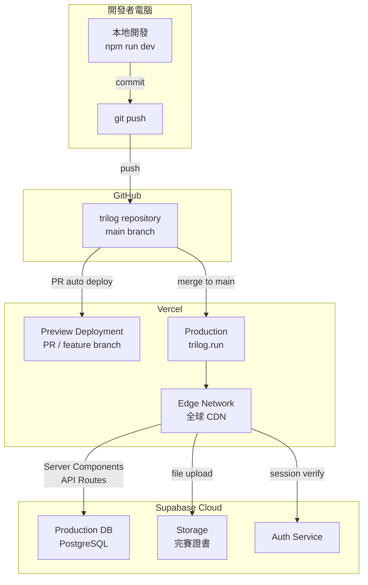

### 9b. AWS 架構方向（規模成長後遷移路徑）

> 當 Vercel / Supabase 免費方案不夠用（用戶 > 10K 或需要更多控制）時，可按以下架構遷移至 AWS。

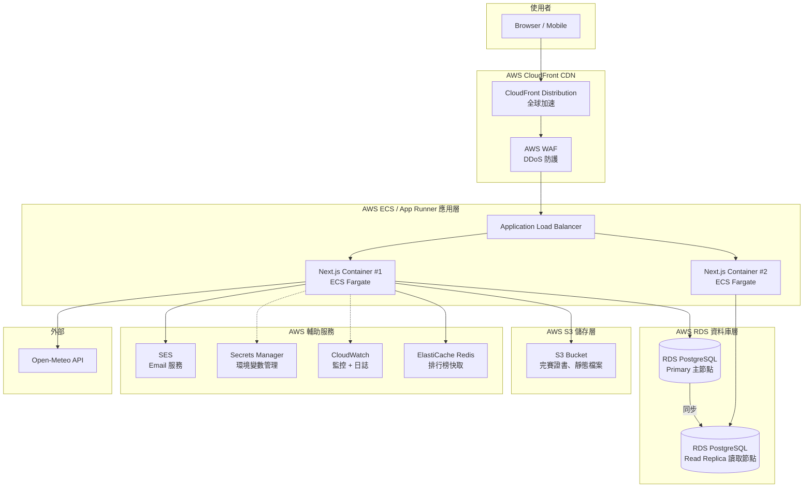

### AWS 服務對應表

| AWS 服務 | 對應現行服務 | 用途 |
|----------|------------|------|
| **CloudFront** | Vercel CDN | 靜態資源快取、全球加速 |
| **ECS Fargate** | Vercel Serverless Functions | Next.js 應用容器 |
| **RDS PostgreSQL** | Supabase PostgreSQL | 主資料庫 |
| **Cognito** | Supabase Auth | 用戶認證（或保留自建 Auth） |
| **S3** | Supabase Storage | 完賽證書檔案儲存 |
| **SES** | Resend | 大量 Email 發送 |
| **ElastiCache** | ——（尚未有快取層） | 排行榜查詢結果快取（Redis） |
| **WAF** | ——（Vercel 內建防護） | 應用層 DDoS / SQL Injection 防護 |
| **Secrets Manager** | `.env.local` | 安全管理 API Keys / DB 密碼 |
| **CloudWatch** | ——（Vercel Analytics） | 日誌集中、效能監控、告警 |

### 遷移時機建議

| 指標 | 現行方案上限 | 遷移訊號 |
|------|------------|---------|
| 月活躍用戶 | 5 萬（Supabase free） | > 8,000 MAU |
| 資料庫大小 | 500 MB | > 400 MB |
| Storage | 1 GB | > 800 MB |
| 每月 Email | 3,000 封（Resend free） | > 2,500 封/月 |

---

## 10. 關鍵設計決策 Q&A

**Q：為什麼用 Route Groups `(main)` 和 `(auth)`？**  
A：Route Group 只影響 URL 路徑分組，不出現在實際 URL。這讓我們可以讓 `/leaderboard` 和 `/login` 使用**完全不同的 Layout**（一個有 Nav，一個是全螢幕置中），而不需要在同一個 Layout 裡做判斷。

**Q：Supabase client 為什麼有三個版本？**  
A：因為 Next.js 的三個執行環境各有不同的 Cookie 存取方式：
- `client.ts`：瀏覽器端，用 `createBrowserClient`，可直接讀寫 document.cookie
- `server.ts`：Server Component，用 `cookies()` from `next/headers`，只能在 server 端呼叫
- `middleware.ts`：Edge runtime，用 `request.cookies`，因為 Edge 環境沒有 `next/headers`

**Q：為什麼成績時間用秒數（integer）而不是字串？**  
A：整數排序效率遠高於字串比較，排行榜的核心操作就是 `ORDER BY total_seconds`。UI 顯示時再呼叫 `secondsToTime()` 轉為 `HH:MM:SS`。

**Q：claim_tag_count 為什麼要反正規化？**  
A：排行榜查詢每次需要顯示每個成績的標記數。如果每次都 `COUNT(claim_tags WHERE result_id = ?)` 就需要 JOIN，對幾千筆資料的查詢效能很差。改為在 `results` 表上維護一個快取計數，由 trigger 自動更新，查詢時直接讀取。

**Q：為什麼策展層（official）成績可以在排行榜顯示，即使 athlete_id = null？**  
A：這是冷啟動設計。平台剛上線時沒有用戶，但助手已預先建立歷史賽事成績。讓這些未認領成績顯示在排行榜，訪客第一天就看到有意義的內容，「等待選手來認領」本身也成為社群話題。

**Q：unlinked 狀態解決了什麼問題？**  
A：選手可能不知情地被助手建檔（例如接力賽成績）。認領後如果想撤回公開，直接刪除會破壞策展層的完整性（別人可能已截圖或引用這筆紀錄）。`unlinked` 讓選手可以「解除與帳號的關聯」，成績繼續以匿名公共資料保留，選手的帳號頁面不再顯示。

---

*文件最後更新：2026-06-02*  
*對應 spec 版本：trilog_spec_v11（v1.0）*
